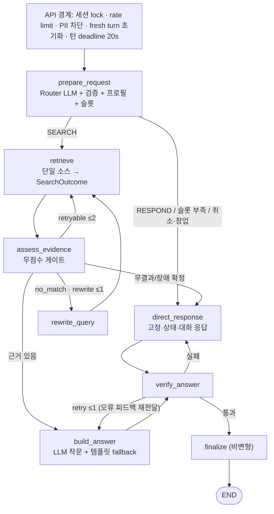

# 정책나침반 현재 상태 종합 분석 (Claude Peer Review)

- 기준 스냅샷: 2026-07-15 02:59 UTC working tree (마지막 커밋 `0cb1804` + 미커밋 대규모 변경, **활발히 편집 중** — 라인 번호는 이동할 수 있음)
- 검증 자산: 전체 테스트 스위트(최근 267 passed), 재현 스크립트(16종 발화 강등률·게이트 실측·explain 수치 주입·부분 커버 grounded 답변·pending 전이), 가짜 LLM 주입 시뮬레이션
- 문서 성격: Claude·Codex 교차 검토의 Claude 측 기준 문서. 과거 감사·검증 이력은 git 이력 참조.

---

## 1. 프로젝트 핵심과 현재 아키텍처

### 1.1 제품 범위 (확정된 결정 반영)

**청년 대상 3개 공식 데이터 소스 안내 에이전트**: 온통청년(정책·제도, 5개 분야), 고용24 훈련과정(실제 과정), 고용24 채용 보조정보(채용행사·공채속보). FastAPI + LangGraph + Upstage Solar + Supabase 메모리 + Langfuse tracing + React.

- 창업(기업마당)은 **삭제 확정** — 창업 질문은 `startup_redirect` 고정 안내(기업마당·K-Startup 링크).
- 검색 없는 일반 응답의 목적은 "도메인 개념·용어 질의응답 + 직전 후보 후속 질의"로 확정. 수치·현행 기준 질문은 SEARCH 승격 대상.
- 일반 대화 응답이 최근 임의 수정에서 고정 문구 → **LLM 생성으로 반전**됨(인사·감사 등만 고정 문구 fallback) — 의도된 제품 결정인지 팀 확인 필요.

### 1.2 그래프 (8노드, bounded loop 3종)

### 1.3 핵심 모듈 맵

| 모듈 | 책임 |
| --- | --- |
| `app/graph/nodes.py` | 8노드 구현. `prepare_request`가 Router LLM·route 검증·프로필·슬롯을 통합 |
| `app/graph/search_contracts.py` | `SearchOutcome(success/no_match/unavailable/partial)`, guide 후보→warnings 변환 |
| `app/graph/evidence.py` | 3소스 공통 무점수 게이트(연령·지역·마감·관련성·채용 유형·중복) |
| `app/graph/validators.py` | route 계약·semantic guard, 응답 grounding(제목·URL)·슬롯 언급·상태 고지·수치 검열 |
| `app/graph/profile_contracts.py` | `ProfileState` allowlist 검증, 필드별 CLEAR 패턴 |
| `app/graph/fallbacks.py` | LLM 장애용 키워드 라우팅, pending 전이 판정, 창업·취소 감지 |
| `app/graph/response_composer.py` | LLM 작문(grounded·상태·대화·후속) + 결정론 템플릿, 검증 오류 피드백 재프롬프트 |
| `app/api/routes/chat.py` | 세션 lock·rate limit·턴 deadline·후보 스냅샷(SET/CLEAR/UNCHANGED)·피드백 API·trace_id |
| `app/core/session_control.py` | 프로세스 내 세션 lock·sliding window rate limiter |
| `app/repositories/*` | 온통청년(연령 구조화·zipCd 필터·만료 제외), 고용24 훈련(지역 코드 resolver), 채용 3종 |

### 1.4 상태 계약

- 턴 전용 상태는 API 진입·Router 진입에서 `fresh_turn_fields()`로 이중 초기화 — checkpointer 없음(상태 누출 해소 검증됨).
- 영속 상태는 Supabase: profile(검증됨)·최근 8메시지·`pending_request(required_slots 포함)`·`last_presented_candidates`(allowlist 스냅샷, 후속 질의 전용).
- pending 전이: RESUME(슬롯 교집합 조건)/CANCEL/REPLACE/KEEP.

---

## 2. 현재 상태 평가

### 2.1 잘 구축된 기반 (유지)

상태 격리와 8노드 bounded-loop 그래프, `SearchOutcome`의 무결과/장애 구분, 3소스 공통 게이트의 hard-mismatch 개념, guide 가짜 후보 제거, allowlist 후보 스냅샷, ProfileState 검증·CLEAR, 세션 lock·rate limit·턴 deadline·`/api/ready`, CI/CD(head_sha 고정·Langfuse 운영 키·frontend job), PII 사전 차단, 231개 테스트.

### 2.2 최근 임의 수정의 방향 (긍정)

검색 답변·상태 안내·일반 대화·후보 후속이 LLM-first + 결정론 fallback으로 복원됐고, **검증 실패 시 오류 목록과 이전 답변을 LLM에 재전달하는 자기수정 루프**가 추가됐다. "LLM이 제안하고 코드가 검증한다" 재균형 원칙과 일치하는 올바른 방향이다. 검증 규칙 확장(슬롯 언급 검사, unavailable/partial 고지 검사)도 유용하다.

---

## 3. 미해결 이슈 (2026-07-15 02:59 기준 재확인)

### P0 — 체감 품질의 직접 원인

| # | 이슈 | 근거·재현 | 수정 방향 |
| --- | --- | --- | --- |
| 1 | **semantic guard가 LLM의 올바른 SEARCH 판단을 고정 문구로 강등** (`nodes.py` `non_search_request_misclassified`) | 가짜 LLM 주입: 자연 발화 **16종 중 11종(69%) 차단**. "월세 지원 받으려면?", "채용정보 좀 보여줘", "자비부담액이 뭐야?" 등 전부 범위 안내 문구 | 강등 방향 override 제거. 명시적 범위 밖 신호 매치일 때만 뒤집기. 승격 방향 2종은 유지 |
| 2 | **근거 게이트의 unknown=제외 정책** (`evidence.py`) | 실측: 온통청년 5→1건(서울 청년수당이 `age_unverified`로 탈락), 온라인 훈련과정 `region_unverified` 무조건 탈락, region 없는 공채속보 탈락 | `*_unverified`는 제외가 아니라 "확인 필요" 표시로 통과. 명시 불일치·마감만 hard 제외. 온라인 과정 지역 면제 |
| 3 | **timeout 모순** (`config.py`: LLM 5s·source 4s) | 온통청년 내부 최대 6회 순차 호출(클라이언트 10s)·훈련 15s·채용 20s가 바깥 4s와 충돌 → 정상 API도 unavailable. LLM 호출이 턴당 4~5회로 늘어 5s tail 폴백 위험 증가 | LLM 10~15s, source 8~10s(내부 호출 축소·병렬화 병행), turn 20s 유지 |

### P1

| # | 이슈 | 근거 | 수정 방향 |
| --- | --- | --- | --- |
| 4 | **전-후보 인용 요구 × LLM 자유 작문 충돌**: SEARCH 답변이 모든 후보 제목+URL을 포함해야 통과 → "1개만 추천" 스타일 답변이 재시도 후 "중단했어요"로 대체 (재현) | `validators.py` requires_all_evidence | 검증 실패의 최종 fallback을 abstention이 아닌 **결정론 템플릿 `renderer(candidates)`**로. 또는 부분 커버 허용(언급 사실의 일치만 검사) |
| 5 | **수치 검열의 전면 중단**: explain(및 확대된 general·out_of_scope)에서 원·%·연도·URL 포함 정상 설명이 abstention으로 대체 (재현). 실 LLM은 피드백으로 자기수정 가능하나 수치가 본질인 질문은 구제 불가 | `_UNSUPPORTED_EXPLANATION_FACT` 4개소 | 수치 문장만 결정론 제거·완곡화 후 전달, 또는 해당 질문 SEARCH 승격 |
| 6 | pending 중 "서울이면 됐어"(슬롯 답변)가 취소로 처리 — 취소 검사가 슬롯 충족보다 선행 + "됐어" 과탐욕 | 재현 | 슬롯 데이터 동반 시 RESUME 우선, 취소 마커는 짧은 단독 발화 한정 |
| 7 | 세션 owner binding 부재 (service-role로 임의 session_id 조회 가능), lock·rate limiter는 프로세스 로컬 | 코드 확인 | 완전 공개 전 필수. 서명 세션 토큰 + owner 조건 |
| 8 | 서버 보존 TTL·세션 삭제 API 부재 (피드백 저장으로 보존 데이터 증가) | 코드 확인 | TTL + `DELETE /api/sessions/{id}` |
| 9 | 새 구조 기준 Langfuse 평가 미실행 — 기존 93.3%는 구조 변경 전 수치 | 평가 리포트 대조 | 평가 재실행 + working tree SHA 기록. 가장 저비용·고정보량 |

### P2·P3

광주/전남 equivalence가 자격 판정에 잔존(`regions.py` — 순천↔광주 exact, 분리 여부 팀 확정), 프로필 삭제 시 확인 문구 부재, named-policy 질문이 휴리스틱 경로에서 recommend+슬롯 3개로 감, **온통청년 일자리·교육 분야와 고용24의 교차 소스 비가시성**(아래 4.4), httpx pooling 부재, 채용 repo 내부 timeout 20s 무의미, semantic 평가 지표 미도입, SSE는 여전히 완성 답변 청크 재전송.

---

## 4. 대화에서 확정·제안된 결정 사항 (최신)

### 4.1 확정 — 구현 완료

- **기업마당·창업 시나리오 삭제** + 창업 질문은 `startup_redirect` 고정 안내. 근거: 기창업·중소기업 중심 데이터, 연령 필드 부재.
- **스코어링 재정의**: 가중치 점수 폐기, 3소스 공통 **무점수 결정론 게이트**만. (단 게이트의 unknown 처리 강도는 이슈 #2로 재조정 필요)
- **explain 범위**: 도메인 개념·용어 / 직전 후보 후속(스냅샷 참조) / 수치·현행 기준은 SEARCH 승격 / 잡담·타 분야는 고정 문구. `last_presented_candidates` 스냅샷 구현 완료.

### 4.2 합의된 원칙 — 부분 구현

**"LLM이 제안하고, 코드가 검증한다"**: 작문 복원과 피드백 루프는 구현됨(2.2). 라우팅 신뢰(이슈 #1)·게이트 강도(#2)·검증 실패 처리(#4·#5)가 아직 원칙과 어긋남.

### 4.3 팀 확인 필요

- 일반 대화의 LLM 생성 전환(고정 문구 제품 결정의 반전) 유지 여부.
- 광주/전남을 자격 판정에서 분리할지(행정 통합 반영 여부).

### 4.4 제안 — 교차 소스 핸드오프 (온통청년 취업 분야 ↔ 고용24)

온통청년의 일자리·교육훈련 분야는 **정책·제도**, 고용24는 **실물 과정·행사**로 서로 보완 관계인데 단일 Tool 원칙 때문에 한 질문에 하나만 노출된다. 단일 호출 원칙은 유지하되:

1. 분류 기준 명문화 — "지원금·제도를 묻는가"(youth_policy) vs "수강할 과정·참여할 행사를 묻는가"(고용24). 휴리스틱의 `교육→training` 단독 매핑 완화.
2. 검색 답변 말미에 **결정론 교차 안내 1문장** ("훈련 비용·수당 지원 정책은 온통청년에서 찾아드릴 수 있어요") + 응답 시 이전 조건으로 다음 소스 검색.
3. NO_MATCH 시 보조 소스 1회 대체 검색(상한 있는 전이).
4. (후순위) timeout·pooling 정리 후 취업 도메인 한정 병렬 호출 + 구획 표시. `search_outcome` 복수화가 필요해 지금은 보류.

---

## 5. 다음 액션 (권장 실행 순서)

1. **이슈 #1 강등 제거** → 16종 발화 배터리로 회귀 확인 (차단 0건 목표)
2. **이슈 #2 게이트 완화** → 게이트 실측 스크립트로 회귀 확인 (부당 탈락 0건)
3. **이슈 #3 timeout 상향** + **#4 fallback을 템플릿으로** → 중단 문구 빈도 확인
4. **이슈 #9 새 구조 Langfuse 평가 재실행** (SHA 기록) — 위 수정 효과의 실측 성적표
5. 이슈 #5·#6 (수치 검열 전환·취소 순서)
6. 완전 공개 준비: #7 owner binding·#8 TTL/삭제, 멀티 worker 대응
7. 4.4 교차 소스 핸드오프 (1·2번 항목부터)

**배포 판단**: 내부 시연·제한 베타 가능. 완전 공개는 #7·#8·#9 해결 전 보류. 1~3번 수정 전에는 시연에서도 자연 발화 오차단·무결과·중단 문구가 빈발하므로, 시연 시나리오는 키워드가 명확한 발화로 한정하거나 1~3번을 먼저 반영할 것을 권한다.

---

## 6. 회귀 검증 자산

수정 후 아래를 재실행하면 개선 여부가 정량 확인된다 (모두 외부망·실 LLM 불필요):

| 스크립트 | 측정 | 현재 값 |
| --- | --- | --- |
| 16종 자연 발화 + 가짜 LLM(올바른 SEARCH 고정) | semantic guard 강등률 | **11/16** |
| 게이트 실측(현실적 후보 5·3·3건) | 소스별 before→after, rejection_reasons | 온통청년 5→1, 훈련 3→1, 채용 3→1 |
| explain 수치 주입(피드백 미반영 가정) | abstention 여부 | 중단 문구 발생 |
| 부분 커버 grounded 답변(후보 3 중 1 언급) | 검증→중단 여부 | 중단 문구 발생 |
| pending 전이(인사/취소/슬롯/"서울이면 됐어") | RESUME/CANCEL/KEEP 정확도 | "서울이면 됐어"만 오작동 |
| pytest 전체 | 회귀 | 267 passed |
