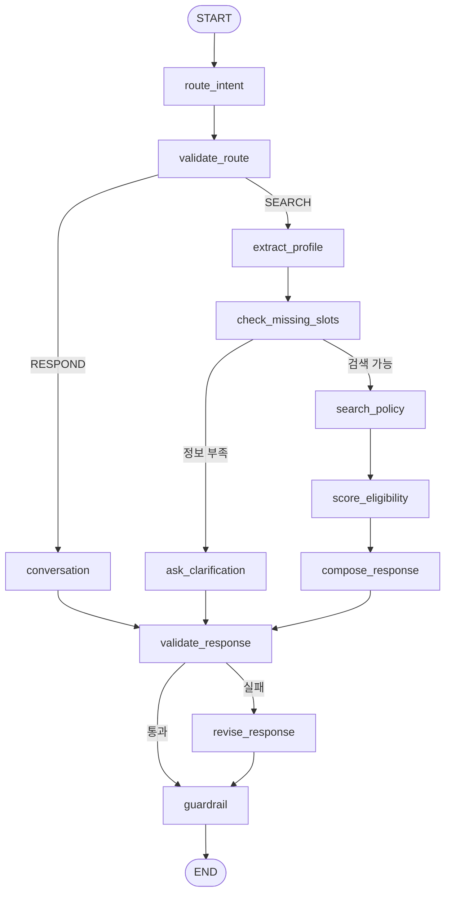
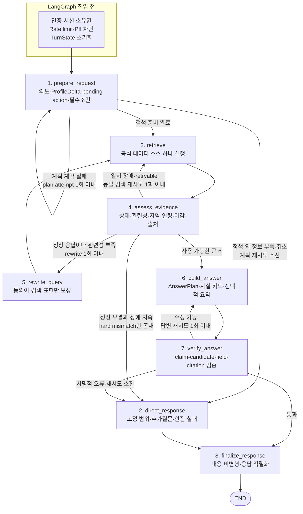

# 정책나침반 시스템 아키텍처 감사 및 리팩터링 계획

- 작성일: 2026-07-14
- 감사 기준: 현재 로컬 working tree와 저장된 Langfuse 평가 결과
- 대상: FastAPI API, LangGraph 오케스트레이션, 대화 상태, 외부 데이터 어댑터, 자격 판정, 답변 grounding, Langfuse 평가, 프런트엔드, CI/CD, 운영·보안
- 문서 성격: 읽기 전용 시스템 감사 결과 및 구현 계획
- 구현 변경: 이 문서 작성 외 애플리케이션 코드는 변경하지 않음

> 중요: 이 문서는 특정 응답 문구 하나를 고치는 패치 목록이 아니다. 반복되는 증상의 공통 원인을 찾고, 공개 서비스가 가능한 구조로 전환하기 위한 기준 문서다.

---

## 1. 결론 요약

현재 정책나침반은 공식 데이터 소스, 구조화된 라우팅, 개인정보 사전 차단, 결정적 fallback, Langfuse tracing 등 유용한 기반을 갖춘 **데모/MVP 단계의 시스템**이다. 그러나 공개 실서비스 관점에서는 배포를 보류해야 한다.

가장 큰 문제는 LangGraph 노드 수가 적은 것이 아니다. 현재는 `START/END`를 제외하고 12개 노드가 등록되어 있지만, 구조적으로는 역방향 edge가 하나도 없는 DAG(Directed Acyclic Graph)다. 정상·실패·부분 성공 상태를 구분해 이전 단계로 돌아가는 feedback loop가 없기 때문에 실제 동작은 다음과 같은 조회 파이프라인에 가깝다.

```text
판단 → 프로필 추출 → 조건 확인 → 조회 → 점수화 → 답변 생성 → 형식 검증 → 출력
```

즉, **노드는 기능에 비해 세분화되어 있지만 상황 대응력은 부족하다.**

근본 문제는 다음 다섯 가지다.

1. 영속 세션 상태와 턴 전용 검색·검증 상태가 하나의 `AgentState`와 `MemorySaver`에 섞여 있다.
2. 외부 API의 성공·무결과·장애·부분 성공·필터 미적용을 표현하는 공통 결과 계약이 없다.
3. 나이·지역·취업 상태를 질문하더라도 실제 검색과 자격 판정에 소스별로 일관되게 적용되지 않는다.
4. Route/Response Validator가 의미·자격·주장 단위의 2차 검증이 아니라 형식·제목·URL 존재 확인에 머문다.
5. 기존 Langfuse 평가는 그래프가 실행됐는지는 측정하지만 답변이 실제로 맞는지는 거의 측정하지 않는다.

권장 방향은 전체 재작성이나 노드 추가가 아니다.

- 현재 12개 노드를 약 8개의 의미 있는 상태 전이 노드로 통합한다.
- 계획, 검색 근거, 답변 검증 세 지점에 횟수가 제한된 feedback loop를 둔다.
- `SearchOutcome`, `NormalizedCandidate`, `EligibilityAssessment`, `AnswerPlan` 계약을 도입한다.
- `MemorySaver`와 Supabase의 이중 상태를 단일화하고 턴 상태를 매 요청 새로 만든다.
- 현재의 기계적 smoke 평가를 의미·자격·근거·출처·멀티턴 상태 평가로 교체한다.

### 1.1 종합 판정

아래 점수는 자동 지표가 아니라 코드·trace·재현 결과를 바탕으로 한 정성적 감사 등급이다.

| 영역 | 판정 | 근거 요약 |
| --- | --- | --- |
| 기본 모듈 분리 | 양호 | Repository/Tool, fallback, prompt, graph, API 계층이 분리됨 |
| LangGraph 오케스트레이션 | 보완 필요 | 노드 12개이나 회복 loop 0개, 미세 기능 단위 노드가 많음 |
| 멀티턴 상태 안정성 | 취약 | 이전 검색 결과 누출, pending 오재개, 이중 메모리 |
| 검색·자격 정확성 | 취약 | 기업마당 외 공통 eligibility 부재, 일부 조건 미적용 |
| 답변 grounding | 취약 | 제목·URL 집합 검사만 수행, claim 단위 연결 없음 |
| 평가 신뢰도 | 취약 | 93.3% PASS 안에 명백한 오답 포함 |
| 개인정보 사전 차단 | 부분 양호 | 그래프 진입 전 식별자 차단은 좋으나 보존·삭제·동의 정책 미완성 |
| 공개 서비스 보안 | 출시 차단 | 인증·세션 소유권·rate limit 부재 |
| 운영 안정성 | 보완 필요 | 전체 deadline, readiness, pooling, circuit breaker 부족 |
| 현재 제품 단계 | 데모/MVP | 제한된 내부 시연에는 가능, 공개 서비스에는 부적합 |

---

## 2. 감사 범위와 방법

### 2.1 확인한 근거

- 실제 LangGraph 구성: [`app/graph/graph.py`](../app/graph/graph.py)
- 상태·노드·검증: [`app/graph/state.py`](../app/graph/state.py), [`app/graph/nodes.py`](../app/graph/nodes.py), [`app/graph/validators.py`](../app/graph/validators.py)
- API와 메모리: [`app/api/routes/chat.py`](../app/api/routes/chat.py), [`app/repositories/chat_memory.py`](../app/repositories/chat_memory.py)
- 네 외부 데이터 소스 Repository와 Tool 스키마
- 지역 정규화와 eligibility scoring
- 프런트엔드 응답 계약과 로컬 저장소
- 테스트와 GitHub Actions CI/CD
- 저장된 Langfuse 30개 시나리오 평가:
  - [`reports/langfuse/lf-eval-20260714-124718.md`](../reports/langfuse/lf-eval-20260714-124718.md)
  - [`reports/langfuse/lf-eval-20260714-124718.json`](../reports/langfuse/lf-eval-20260714-124718.json)

### 2.2 사용한 판단 기준

실제 서비스형 질의응답 시스템은 다음 질문에 답할 수 있어야 한다.

1. 현재 요청은 누구의 어떤 세션에 속하는가?
2. 현재 턴에 필요한 상태와 이전 턴에서 유지할 상태가 명확히 분리되는가?
3. 외부 검색은 성공, 정상 무결과, 장애, 부분 성공 중 어느 상태인가?
4. 사용자가 제공한 조건이 실제 upstream 필터와 후처리 판정에 적용됐는가?
5. 선택한 후보가 질문과 관련 있고 명시적 자격 불일치가 없는가?
6. 최종 답변의 각 사실이 정확한 후보와 출처에 연결되는가?
7. 실패가 복구 가능한지, 재시도해야 하는지, 안전하게 포기해야 하는지 구분되는가?
8. 평가 PASS가 실제 사용자 관점의 정답을 의미하는가?
9. 비용·지연·개인정보·권한·동시성에 운영 상한이 있는가?

### 2.3 감사 한계

- 저장된 30개 Langfuse 평가는 최신 validator 변경 이전에 생성된 역사적 baseline이다.
- 최신 validator를 포함한 최근 trace는 일반 범위 안내 경로 위주이며, 변경 이후 네 검색 경로 전체 회귀 결과는 아직 없다.
- 본 문서는 현재 working tree 기준이다. 커밋 전 변경 사항이 있으므로 구현 시 코드와 문서의 차이를 다시 확인해야 한다.

---

## 3. 현재 시스템 구조

### 3.1 전체 요청 흐름

```text
React UI
→ FastAPI /api/chat 또는 /api/chat/stream
→ Supabase recent_history/profile/pending_request 로드
→ 개인정보 식별자 차단
→ LangGraph 실행(session_id = thread_id)
→ 선택된 공식 데이터 Tool 하나 호출
→ LLM 또는 결정적 템플릿으로 응답 생성
→ 응답 검증·보정·guardrail
→ Supabase에 대화/profile/pending_request 저장
→ SSE로 완성된 답변을 잘라 전송
```

### 3.2 현재 LangGraph

현재 등록 노드는 12개다. 근거는 [`app/graph/graph.py` 22~33행](../app/graph/graph.py#L22-L33)이다.



### 3.3 구조 해석

- 분기 edge는 있지만 역방향 edge는 없다.
- `validate_route` 실패는 다시 라우팅하지 않고 heuristic fallback으로 덮어쓴다.
- 검색 결과의 관련성이 낮아도 질의를 보정해 다시 검색하지 않는다.
- `validate_response` 실패 후 한 번 보정하지만 보정 결과를 다시 검증하지 않는다.
- 마지막 `guardrail`이 검증이 끝난 문자열을 다시 변경한다.

따라서 현재 그래프는 **분기형 DAG**이지 **실패 회복형 상태 머신**이 아니다. 첫 번째 정상 실행 trace가 직선으로 보이는 것 자체보다, 전체 그래프에도 의미 있는 cycle이 없다는 점이 핵심 문제다.

### 3.4 앞서 비교한 다른 프로젝트 그래프와의 차이

두 번째 참고 이미지는 문서 RAG에 특화된 `retrieve → document grade → query rewrite → hallucination grade` 구조이므로 그대로 복사할 필요가 없다. 정책나침반은 주로 구조화된 정부 API 데이터를 사용하기 때문이다.

그러나 세 번째 이미지는 정상 작동한 다른 프로젝트의 LangGraph라는 점에서 비교 가치가 있다. 노드 이름을 제외하고 구조만 보더라도 다음 패턴이 확인된다.

- 주 경로와 대체 경로가 분리됨
- 중간 판정 결과에 따라 이전 처리 단계로 돌아가는 feedback edge가 있음
- 복구 가능한 실패와 즉시 종료할 실패가 구분됨
- 여러 terminal path가 공통 종료 지점으로 모임

정책나침반이 가져와야 하는 것은 그 프로젝트의 노드 개수나 업무 기능이 아니라 이 **제어 흐름 패턴**이다. 본 문서의 목표 그래프는 이를 정책 도메인에 맞춰 계획 재시도, 검색어 재작성, 답변 재검증의 세 cycle로 축소한 구조다.

---

## 4. 유지할 가치가 있는 기반

전체 재작성은 권장하지 않는다. 다음 요소는 유지하면서 계약을 강화하는 편이 효율적이다.

1. 데이터 소스별 Repository와 Tool 분리
2. `RoutingDecision`의 Pydantic 구조화 출력
3. 정상 LLM 판단과 장애 fallback 규칙의 분리
4. 질문당 외부 Tool 하나만 호출하는 원칙
5. 후보 외 사실 생성을 금지한 prompt
6. 기업마당의 결정적 자격 점수화와 hard mismatch 개념
7. 온통청년 지역 코드·만료일 필터와 일부 장애 재시도
8. 개인정보 식별자를 LangGraph·LLM·외부 API·Langfuse 이전에 차단하는 API 경계
9. 외부 API 로그에서 인증 URL과 키를 숨기는 로깅 경계
10. 결정적 clarification/fallback 템플릿
11. Langfuse callback과 30개 시나리오 평가의 초기 기반
12. 프런트엔드의 UUID 세션, 로컬 저장량 제한, 민감정보 마스킹

이 기반 위에서 상태·검색 결과·근거·평가 계약을 다시 세우면 된다.

---

## 5. 핵심 구조적 문제

### 5.1 P0 — 턴 상태와 영속 상태가 섞여 이전 결과가 누출됨

`AgentState`에는 다음이 함께 존재한다.

- 영속 대상: `profile`, `conversation_history`, `pending_request`
- 턴 전용 값: `user_input`, route, missing slots, 검색 결과 배열, validation 상태, 최종 답변

근거: [`app/graph/state.py` 6~39행](../app/graph/state.py#L6-L39)

그래프는 전역 `MemorySaver`로 한 번 컴파일되고, API는 사용자가 보낸 `session_id`를 그대로 `thread_id`로 사용한다.

- `MemorySaver`: [`app/graph/graph.py` 74행](../app/graph/graph.py#L74)
- `session_id → thread_id`: [`app/api/routes/chat.py` 95~99행](../app/api/routes/chat.py#L95-L99)
- 새 요청의 부분 initial state: [`app/api/routes/chat.py` 103~112행](../app/api/routes/chat.py#L103-L112)

새 턴에서 덮어쓰지 않은 필드는 checkpoint에 남을 수 있다. `conversation_node`는 일반 대화에서 `final_response`만 반환하고 검색 결과를 초기화하지 않는다. 이후 `guardrail`은 현재 턴에 검색했는지가 아니라 결과 배열이 존재하는지만 보고 신청 가능 여부 확인 문구를 붙인다.

#### 직접 재현된 증상

```text
1턴: 청년 주거 정책 검색
2턴: 안녕

실제 결과:
- 2턴은 RESPOND/general로 분류됨
- 1턴의 youth_policy_results가 그대로 남음
- 일반 범위 안내 뒤에 신청 가능 여부 확인 문구가 붙음
- API 결과에도 이전 추천 데이터가 남을 수 있음
```

이는 앞선 화면에서 보인 상황과 맞지 않는 고정 문구의 근본 원인 중 하나다. 문구만 바꾸면 다시 다른 형태로 재발한다.

#### 수정 방향

- `DurableSessionState`와 `TurnState`를 분리한다.
- 한 턴 안에 그래프가 끝나고 Supabase가 영속 상태를 담당한다면 `MemorySaver`를 제거한다.
- checkpoint가 꼭 필요하면 `session_id + turn_id`를 thread 경계로 사용한다.
- 모든 턴은 빈 검색 결과, 빈 검증 결과, 0으로 초기화된 retry counter로 시작한다.

#### 완료 기준

- 정책 검색 다음에 일반 인사를 보내도 이전 결과·카드·disclaimer가 0건이다.
- 네 소스 중 선택되지 않은 결과 bucket은 항상 비어 있다.
- 프로세스 재시작 전후 영속 상태의 단일 출처가 명확하다.

### 5.2 P0 — pending 작업의 재개·취소·교체 상태 전이가 없음

현재 LLM이 `resume_pending=true`를 반환하면 현재 발화가 실제 누락 슬롯을 채웠는지 결정적으로 확인하지 않고 기존 검색을 재개한다. heuristic fallback에서는 pending이 있는 상태의 일반 발화를 기존 작업의 답변으로 간주할 수 있다.

근거: [`app/graph/nodes.py` 124~165행](../app/graph/nodes.py#L124-L165)

#### 직접 재현된 증상

```text
1턴: 지원사업 추천해줘
→ 지역·나이·분야가 부족하여 pending 생성

2턴: 안녕하세요
→ 일반 인사가 아니라 이전 검색을 재개
```

현재 `pending_request`에는 원래 요청, 종류, mode, query만 있으며 다음이 없다.

- 기다리는 슬롯 목록
- 현재 발화가 채운 슬롯
- 취소·교체·유지 여부
- 만료 시각
- clarification 횟수
- task ID

#### 수정 방향

`PendingTask`와 `pending_action`을 구조화한다.

```text
pending_action
- NONE: 진행 중 작업 없음
- RESUME: 현재 ProfileDelta가 required_slots를 실제로 채움
- CANCEL: 사용자가 취소
- REPLACE: 새로운 정책 요청으로 기존 작업 교체
- KEEP: 인사·감정 표현 등 무관 발화, 기존 pending 유지
```

`RESUME`은 LLM 단독 판단이 아니라 `ProfileDelta.keys ∩ required_slots`가 비어 있지 않을 때만 허용한다.

#### 완료 기준

- 인사로 pending이 재개되지 않는다.
- “그거 취소해줘”는 pending을 삭제한다.
- 새 정책 질문은 기존 작업을 명시적으로 교체한다.
- 지역·나이 등 실제 누락값을 제공했을 때만 원래 검색을 재개한다.

### 5.3 P0 — 프로필 추출 결과가 타입 검증 없이 누적됨

Profile LLM 결과는 raw dictionary로 파싱된 뒤 Pydantic 모델 검증 없이 기존 profile에 병합된다.

근거: [`app/graph/nodes.py` 227~282행](../app/graph/nodes.py#L227-L282)

영향은 다음과 같다.

- `age="스물다섯"` 같은 잘못된 타입이 도구 입력 또는 API 응답 모델 생성 시점에 늦게 폭발할 수 있다.
- `None`, 빈 문자열, 빈 배열은 무시하므로 사용자가 기존 값을 명시적으로 삭제하기 어렵다.
- topic, desired job 등 현재 작업에만 필요한 값이 다음 도메인으로 남을 수 있다.
- Supabase에서 불러온 profile도 `UserProfile`로 검증하지 않고 사용한다.

#### 수정 방향

- `ProfileDelta`를 Pydantic 모델로 정의한다.
- 각 필드에 `SET`, `CLEAR`, `UNCHANGED` 의미를 둔다.
- `value`, `source_turn_id`, `explicit`, `verified_at`, `expires_at`을 저장한다.
- 나이·지역 같은 안정 프로필과 query/topic/job 같은 작업별 조건을 분리한다.

### 5.4 P0 — 검색 결과가 단순 리스트라 실패 원인을 잃음

Tool wrapper는 예외를 빈 리스트로 바꾸고, 일부 Repository는 장애·키 미설정·파싱 실패를 `guide`라는 가짜 후보로 반환한다.

근거:

- Tool 예외 처리: [`app/tools/executor.py`](../app/tools/executor.py)
- 온통청년 guide: [`app/repositories/youthcenter.py`](../app/repositories/youthcenter.py)
- 훈련 guide: [`app/repositories/work24_training.py`](../app/repositories/work24_training.py)
- 채용 guide: [`app/repositories/work24_recruitment.py`](../app/repositories/work24_recruitment.py)

그래프는 다음 상태를 구분할 수 없다.

- 정상 조회 0건
- timeout 또는 429
- 5xx
- 인증키 오류
- 응답 파싱 실패
- 일부 endpoint만 성공
- 요청한 필터가 upstream에 적용되지 않음
- 결과는 왔지만 모든 후보가 자격 불일치

이 상태를 모르면 동일 요청 재시도, query rewrite, 장애 안내, 무결과 안내 중 무엇을 해야 하는지 판단할 수 없다.

#### 수정 방향

모든 어댑터는 공통 `SearchOutcome`을 반환해야 한다.

```text
SearchOutcome
- status: SUCCESS | NO_MATCH | UNAVAILABLE | PARTIAL | RATE_LIMITED | INVALID_RESPONSE
- source
- items
- requested_filters
- applied_filters
- ignored_filters
- retryable
- attempts
- warnings
- fetched_at
- upstream_latency_ms
- total_count
```

`guide` 후보는 제거하고 `status`, `warnings`, `retryable`로 이동한다.

### 5.5 P0 — `score_eligibility`가 네 소스 공통 검증 노드가 아님

현재 `eligibility_scorer_node`는 `search_results`, 즉 기업마당 결과만 평가한다.

근거: [`app/graph/nodes.py` 492~509행](../app/graph/nodes.py#L492-L509)

청년정책, 훈련, 채용 결과는 각각 별도 배열에서 답변 생성으로 바로 전달된다. 따라서 trace에 `score_eligibility` 노드가 보여도 해당 소스에서는 실질적인 no-op일 수 있다.

이 비대칭 때문에 다음을 공통적으로 차단하지 못한다.

- 청년정책 연령·재학·취업 상태 불일치
- 훈련 지역·직무 불일치
- 채용 지역·경력·직무 불일치
- source URL 또는 필수 필드 누락

#### 수정 방향

`score_eligibility`를 모든 소스 공통 `assess_evidence`로 교체한다.

검사 항목:

1. upstream 상태와 필터 적용 여부
2. 주제 관련성 하한
3. 지역·나이·상태 hard mismatch
4. 신청·공고 마감
5. 중복 후보
6. canonical source URL
7. 필수 필드 완전성
8. retry 또는 rewrite 가능 여부

### 5.6 P0 — 검증 노드가 의미적 2차 판단을 제공하지 않음

#### Route Validator

Router는 이미 LLM 결과를 `RoutingDecision`으로 검증한다. 이후 `validate_route`도 동일 계약을 다시 검증한다.

- 최초 검증: [`app/graph/nodes.py` 117~130행](../app/graph/nodes.py#L117-L130)
- 2차 검증: [`app/graph/validators.py` 15~42행](../app/graph/validators.py#L15-L42)

정책 검색 질문을 의미적으로 잘못 `general`로 분류하더라도 JSON 형식만 유효하면 통과한다. 이는 trace에 노드를 추가하지만 독립된 판단을 추가하지 않는다.

#### Response Validator

검색 답변에서는 사실상 다음만 확인한다.

- 후보 제목 중 하나가 답변에 있는가?
- 허용 URL 중 하나가 있는가?
- 알려지지 않은 URL이 추가됐는가?

근거: [`app/graph/validators.py` 64~100행](../app/graph/validators.py#L64-L100)

다음 오류는 잡지 못한다.

- 후보에 없는 금액·기간·나이·지원 조건
- 후보 A의 설명과 후보 B의 URL 결합
- 한 후보만 grounded이고 나머지는 환각인 답변
- 자격 불일치 후보를 “추천”으로 표현
- `null` 필드를 LLM이 추측해 채운 경우

감사 중 현재 validator에 다음 답변을 넣었을 때 모두 오류 배열 `[]`로 통과했다.

1. 나이 35세 사용자에게 대상이 만 19~24세인 정책을 제목·URL과 함께 추천
2. 후보에 없는 “매월 100만원을 5년간 지급”을 제목·URL과 함께 생성

#### 수정 후 재검증 부재

`validate_response → revise_response` 이후에는 `guardrail`로 바로 이동한다. 수정된 답변을 다시 검증하지 않는다.

근거: [`app/graph/graph.py` 62~70행](../app/graph/graph.py#L62-L70)

#### 검증 이후 내용 변경

`guardrail`은 검증이 끝난 문장을 regex로 교체하고 disclaimer를 삭제·재추가한다. 즉 검증한 문자열과 사용자에게 보낸 문자열이 다를 수 있다.

근거: [`app/graph/nodes.py` 672~711행](../app/graph/nodes.py#L672-L711)

#### 수정 방향

- standalone `validate_route`는 `prepare_request` 내부 typed validation으로 통합한다.
- 답변은 자유 문자열보다 `AnswerPlan`을 먼저 만든다.
- `verify_answer`가 candidate ID, source field, claim, citation을 연결해 검사한다.
- 수정 가능한 실패는 `build_answer`로 최대 1회 되돌리고 반드시 재검증한다.
- `finalize_response`는 검증된 문자열을 변경하지 않는다.

---

## 6. 데이터 소스별 정확성 문제

### 6.1 온통청년 청년정책

`YouthPolicySearchInput`에는 나이·취업·졸업 상태가 있지만 정규화된 `YouthPolicyItem`에는 구조화된 최소·최대 연령과 상태 조건이 없고 `target_summary` 문자열만 있다.

검색 자체도 주로 정책명과 지역을 사용한다. 그 결과 사용자에게 나이를 요구하면서도 연령 부적격 정책을 결정적으로 제거할 수 없다.

#### 필수 수정

- API 원본의 최소·최대 연령을 숫자 필드로 정규화
- 취업·재학·졸업 상태를 구조화된 requirement로 변환
- `unknown`과 `not_required`를 구분
- 모든 후보에 공통 `EligibilityAssessment` 적용
- 자격 불일치 후보는 답변 생성 전에 제거

### 6.2 고용24 훈련

그래프는 `training_region` 문자열을 전달하지만 Work24 어댑터는 `training_region_code`가 있을 때만 `srchTraArea1`을 전송한다.

- 그래프 입력: [`app/graph/nodes.py` 422~426행](../app/graph/nodes.py#L422-L426)
- API 요청 조건: [`app/repositories/work24_training.py` 131~147행](../app/repositories/work24_training.py#L131-L147)

현재 문자열을 실제 코드로 채우는 공통 변환 계약이 없어 부산을 물어본 뒤 서울·경기 과정이 반환될 수 있다.

#### 필수 수정

- 공식 Work24 지역 코드 resolver 추가
- `requested_filters`와 `applied_filters`를 비교
- upstream이 지역 필터를 지원하지 않거나 무시하면 후처리 hard filter
- 지역 결과가 없을 때 임의로 타 지역을 추천하지 말고 명시적 참고 결과로 분리

### 6.3 고용24 채용 보조정보

현재 데이터는 일반 채용공고 전체가 아니라 다음 세 종류다.

- 채용행사
- 공채속보
- 공채기업정보

세 그룹의 필터 능력이 다르고, 기업정보는 직무·지역 필터 없이 호출된다. 이후 결과를 round-robin으로 섞기 때문에 “서울 데이터 분석 신입 채용정보”에 일반 기업소개가 섞이는 것은 구조상 자연스러운 결과다.

근거: [`app/repositories/work24_recruitment.py` 183~264행](../app/repositories/work24_recruitment.py#L183-L264)

#### 제품 결정 필요

- 실제 채용공고 소스를 확보하거나,
- 기능명을 “채용행사·공채·기업 탐색 보조정보”로 축소한다.

현재 데이터 역량으로 “신입 채용공고 추천”을 약속하면 안 된다.

### 6.4 기업마당

네 소스 중 eligibility 구조가 가장 발전되어 있지만 다음 문제가 남아 있다.

- 관심 분야 불일치는 정렬 점수만 낮추고 hard exclusion하지 않음
- 최소 관련성·최소 evidence coverage 임계값 없음
- 공고 URL이 없을 때 기업마당 홈페이지를 source URL로 사용
- 검색 태그 편의와 실제 자격 지역을 혼용

홈페이지는 특정 공고의 금액·기간·자격을 입증하는 출처가 아니다. `canonical_url=None`, `source_missing=true`, `discovery_url=기업마당 홈페이지`로 분리해야 한다.

### 6.5 지역 판정

#### 광주·전남 혼용

기업마당 API의 통합 태그 처리를 위해 `광주`, `전남`, `전남광주`를 동일 그룹으로 취급하고, 실제 `region_match_scope`도 exact로 판정한다.

- equivalent group: [`app/core/regions.py` 182행](../app/core/regions.py#L182)
- eligibility 판정: [`app/core/regions.py` 527~544행](../app/core/regions.py#L527-L544)
- 순천시와 광주를 exact로 기대하는 테스트: [`tests/test_regions.py` 217~230행](../tests/test_regions.py#L217-L230)

검색 태그는 통합할 수 있지만 실제 자격 판정에서 광주와 전남은 분리해야 한다.

#### `대전환` 오탐

`_referenced_sidos()`가 단어 경계 없이 alias 포함 여부를 검사하므로 `AI 대전환` 속 `대전`을 지역으로 인식할 수 있다.

근거: [`app/core/regions.py` 453~470행](../app/core/regions.py#L453-L470)

지역 추출은 공식 명칭, 구분자, 조사, 행정구역 문맥을 사용한 boundary-aware matcher로 교체해야 한다.

### 6.6 사용되지 않는 RAG-lite

별도 정책 검색 endpoint의 RAG-lite는 토큰이 하나도 일치하지 않으면 첫 정책들을 반환하며, 실제 챗봇 그래프에도 연결되지 않는다.

근거: [`app/repositories/rag.py`](../app/repositories/rag.py), [`app/api/routes/policies.py`](../app/api/routes/policies.py)

실제 retrieval로 교체하기 전에는 비활성화하거나 “단순 키워드 탐색”으로 기능명을 제한해야 한다.

---

## 7. 실제 Langfuse 평가가 놓친 오류

저장된 30개 시나리오 결과는 28/30 PASS, 93.3%다. 평균 지연시간은 6.15초, p95는 14.39초, 최대는 23.22초다.

그러나 PASS 안에 다음 오답이 포함되어 있다.

| 사례 | 사용자 질문 | 실제 응답 문제 | 기존 판정 |
| --- | --- | --- | --- |
| S12 | 전주 만 23세 대학생, 문화 지원 정책 | 정신건강 심리상담 바우처를 문화정책으로 추천 | PASS |
| S18 | 부산 데이터 분석 국민내일배움카드 | 부산 과정 대신 서울·경기 과정을 반환 | PASS |
| S21 | 서울 데이터 분석 신입 채용정보 | 구체 공고가 아닌 아주산업 등 일반 기업정보 | PASS |
| S25 | 대전 AI 지원사업 | `[강원] ... AI 대전환`을 대전 지역 일치로 판정 | PASS |

근거:

- [S12 저장 결과](../reports/langfuse/lf-eval-20260714-124718.json#L860-L893)
- [S18 저장 결과](../reports/langfuse/lf-eval-20260714-124718.json#L1083-L1116)
- [S21 저장 결과](../reports/langfuse/lf-eval-20260714-124718.json#L1193-L1226)
- [S25 저장 결과](../reports/langfuse/lf-eval-20260714-124718.json#L1339-L1372)

### 7.1 왜 PASS했는가

현재 평가 스크립트가 확인하는 것은 다음이다.

- action/mode/kind가 예상값과 같은가
- missing slot 존재 여부가 예상과 같은가
- 답변이 비어 있지 않은가
- 일부 민감 패턴과 확정 표현이 없는가
- 최종 결과 배열이 1개 이하인가

근거: [`scripts/run_langfuse_eval.py` 330~389행](../scripts/run_langfuse_eval.py#L330-L389)

평가하지 않는 항목:

- 지역·나이·상태 일치
- 검색 결과의 질문 관련성
- 실제 Tool 호출 및 적용된 필터
- 후보별 사실 정확성
- claim과 citation의 연결
- 자격 불일치
- 답변 직접성·완전성
- no-match와 upstream 장애의 구분
- 이전 턴 상태 누출
- retry 횟수와 복구 성공

`single_tool_contract`도 실제 Tool span을 검사하지 않고 결과 배열 개수만 확인한다. 검색인데 배열이 0개여도 `<= 1`이라 PASS할 수 있다.

따라서 현재 초록색 trace와 PASS는 **그래프가 예외 없이 기계적으로 완료됐다는 의미**에 가깝고, **사용자 질문에 올바르게 답했다는 의미가 아니다.**

---

## 8. 권장 목표 LangGraph

### 8.1 설계 원칙

1. 정상 경로는 짧고 직선이어야 한다.
2. 실패했을 때만 제한된 feedback loop에 들어간다.
3. 각 노드는 작은 함수 하나가 아니라 의미 있는 상태 전이 하나를 담당한다.
4. edge는 단순 문자열 유무가 아니라 typed result와 retry budget으로 결정한다.
5. 통신 재시도와 의미 재시도를 구분한다.
6. hard constraint는 query rewrite 과정에서도 완화하지 않는다.
7. 검증 이후 사용자에게 보낼 사실 문장을 변경하지 않는다.
8. 복구할 수 없으면 억지 답변보다 투명한 abstention을 선택한다.

### 8.2 목표 그래프



### 8.3 현재 노드와 목표 노드 매핑

| 현재 노드 | 조치 | 목표 구조 |
| --- | --- | --- |
| `route_intent` | 기능 유지, 구조 변경 | `prepare_request`에 통합 |
| `validate_route` | standalone 노드 제거 | `prepare_request` 내부 typed validation |
| `extract_profile` | 기능 유지, 통합 | `ProfileDelta`를 포함한 `prepare_request` |
| `check_missing_slots` | 노드 제거 | 결정적 함수와 conditional edge |
| `ask_clarification` | 통합 | `direct_response(reason=missing_slots)` |
| `search_policy` | 유지·개편 | 공통 `retrieve`와 source adapter |
| `score_eligibility` | 교체 | 네 소스 공통 `assess_evidence` |
| `compose_response` | 유지·개편 | `build_answer` |
| `conversation` | 통합 | `direct_response(reason=out_of_scope/general)` |
| `validate_response` | 대체·강화 | `verify_answer` |
| `revise_response` | 독립 노드 제거 | `verify_answer → build_answer` feedback loop |
| `guardrail` | 내용 변경 제거 | 비변형 `finalize_response` |
| 없음 | 신규 | `rewrite_query` |

결과적으로 등록 노드는 12개에서 약 8개로 줄지만, 의미 있는 회복 경로는 0개에서 3개로 늘어난다.

### 8.4 retry 정책

retry를 무조건 LangGraph 노드로 만들면 그래프만 복잡해진다. 실패 유형별 실행 위치가 달라야 한다.

| 실패 유형 | 실행 위치 | 조건 | 상한 | 소진 후 |
| --- | --- | --- | --- | --- |
| Planner JSON/계약 오류 | `prepare_request` self-loop | 파싱 실패, action/source 불일치 | 추가 1회 | 결정적 fallback 또는 direct response |
| timeout/429/일부 5xx | source adapter 내부 | `retryable=true`인 통신 오류 | 총 2회 | `UNAVAILABLE` |
| 정상 응답 0건·관련성 부족 | `rewrite_query → retrieve` | 표현 보정 가능 | 1회 | `NO_MATCH` 또는 direct response |
| 답변 claim grounding 실패 | `verify_answer → build_answer` | 수정 가능한 오류 | 1회 | 결정적 카드 또는 abstention |
| 400/401/403/계약 파싱 오류 | 재시도 금지 | 구성·권한·비재시도 오류 | 0회 | 즉시 장애 상태 |

#### 반드시 유지할 hard constraint

query rewrite는 다음을 절대 완화해서는 안 된다.

- 사용자 거주 지역
- 나이
- 취업·재학·창업·사업자 상태
- 신청 마감
- 사용자가 명시한 월세·전세·문화·데이터 분석 등 구체 분야

검색어 보정은 동의어, 띄어쓰기, 불필요한 범용어 제거, 공식 분류명 치환 정도로 제한한다.

### 8.5 retry budget

`TurnState`에 다음을 명시한다.

```text
plan_attempt_count
tool_attempt_count
same_query_retry_count
query_rewrite_count
answer_revision_count
turn_started_at
turn_deadline
```

모든 loop edge는 횟수 상한과 전체 deadline을 동시에 확인해야 한다. 카운터는 node 재진입 때 초기화하면 안 되며 턴 시작 시 한 번만 초기화한다.

---

## 9. 목표 상태와 데이터 계약

### 9.1 상태 수명 분리

#### DurableSessionState

세션을 넘어 유지할 최소 상태다.

```text
owner_id
session_id
state_version
profile
recent_history
pending_task
updated_at
```

#### TurnState

한 요청이 끝나면 폐기할 상태다.

```text
turn_id
user_input
request_plan
search_outcome
evidence_assessment
answer_plan
verification_result
retry_counters
final_response
trace_context
```

#### 분리 원칙

- 검색 결과 배열과 validator 결과는 절대 DurableSessionState에 들어가지 않는다.
- region/age처럼 재사용 가능한 값은 provenance와 TTL을 가진 profile에 저장한다.
- topic, desired job, search query는 기본적으로 pending task 또는 현재 turn에만 저장한다.
- `intent`처럼 `response_mode`에서 도출 가능한 값은 중복 저장하지 않고 API 경계에서 계산한다.

### 9.2 RequestPlan

Router와 Profile Extractor를 각각 호출하기보다 한 번의 구조화된 계획 출력으로 통합할 수 있다.

```text
RequestPlan
- action
- response_mode
- request_kind
- search_query
- profile_delta
- pending_action
- required_slots
- planning_source
- confidence
```

LLM 출력 후 다음은 코드로 검사한다.

- `RESPOND`인데 검색 source가 지정되지 않았는가?
- `SEARCH`인데 `request_kind=general`인가?
- pending resume가 required slot 충족과 일치하는가?
- 현재 발화에 없는 지역을 LLM이 추정했는가?
- profile field 타입과 enum이 유효한가?

### 9.3 ProfileDelta

```text
ProfileDeltaField
- operation: SET | CLEAR | UNCHANGED
- value
- explicit
- source_turn_id
- confidence
- verified_at
- expires_at
```

이 구조를 사용하면 “서울 말고 부산”, “나이는 저장하지 마”, “이전 직무 말고 데이터 분석” 같은 정정과 삭제를 안전하게 처리할 수 있다.

### 9.4 PendingTask

```text
PendingTask
- task_id
- original_request
- request_kind
- response_mode
- search_query
- required_slots
- collected_slots
- created_at
- expires_at
- clarification_count
```

### 9.5 SearchOutcome

```python
class SearchStatus(StrEnum):
    SUCCESS = "success"
    NO_MATCH = "no_match"
    UNAVAILABLE = "unavailable"
    PARTIAL = "partial"
    RATE_LIMITED = "rate_limited"
    INVALID_RESPONSE = "invalid_response"


class SearchOutcome(BaseModel):
    source: SourceType
    status: SearchStatus
    items: list[NormalizedCandidate]
    requested_filters: SearchFilters
    applied_filters: SearchFilters
    ignored_filters: list[str]
    retryable: bool
    attempts: int
    warnings: list[str]
    fetched_at: datetime
    upstream_latency_ms: int | None
    total_count: int | None
```

이 계약이 있어야 `NO_MATCH`와 `UNAVAILABLE`을 다른 사용자 문구와 다른 Langfuse score로 기록할 수 있다.

### 9.6 NormalizedCandidate

네 소스가 공통 후보 구조를 사용해야 한다.

```text
NormalizedCandidate
- candidate_id
- source
- item_type
- title
- canonical_url
- discovery_url
- published_at
- fetched_at
- regions
- age_requirement
- employment_requirements
- education_requirements
- entrepreneur_requirement
- business_registration_requirement
- application_period
- facts
- raw_reference
```

각 사실에는 값만 저장하지 말고 원본 필드 경로를 남긴다.

```text
EvidenceValue
- value
- source_field
- normalized_by
- confidence
- observed_at
```

### 9.7 EligibilityAssessment

```text
EligibilityAssessment
- candidate_id
- decision: ELIGIBLE | INELIGIBLE | UNKNOWN | REFERENCE_ONLY
- hard_mismatches
- matched_requirements
- unknown_requirements
- relevance_score
- evidence_coverage
- exclusion_reason
```

`UNKNOWN`은 적합이 아니다. 알 수 없는 조건은 사용자에게 확인 항목으로 표시하되 적합 점수를 자동 부여하지 않는다.

---

## 10. 답변 생성과 grounding 재설계

### 10.1 현재 문제

현재는 source별 raw 후보를 자유 형식 LLM prompt에 전달하고 최종 문자열에서 제목과 URL 일부만 검사한다. 이 방식은 프롬프트를 아무리 강화해도 다음을 강제하기 어렵다.

- 모든 후보의 사실이 원본 필드와 일치
- 후보별 URL 결합
- 금액·기간·나이의 무추측
- 자격 불일치 제거
- URL이 없는 경우의 투명한 표시

### 10.2 목표 AnswerPlan

```python
class SupportedClaim(BaseModel):
    candidate_id: str
    claim_type: Literal[
        "title",
        "region",
        "age",
        "target",
        "benefit",
        "application_period",
        "method",
        "deadline",
    ]
    value: str
    source_field: str
    citation_url: str | None


class AnswerPlan(BaseModel):
    response_type: str
    selected_candidate_ids: list[str]
    claims: list[SupportedClaim]
    uncertainty_notes: list[str]
    summary_instruction: str | None
```

### 10.3 권장 생성 순서

```text
SearchOutcome
→ 정규화·중복 제거
→ relevance gate
→ eligibility hard filter
→ AnswerPlan
→ 사실 카드 결정적 렌더링
→ 필요한 경우에만 LLM 비교·요약
→ candidate/claim/citation 검증
→ 최종 응답
```

### 10.4 LLM의 역할 제한

LLM이 맡을 수 있는 일:

- 후보 간 차이 요약
- 사용자가 이해하기 쉬운 비교 문장
- 확인해야 할 조건 정리
- 질문의 의도와 검색어 계획

코드가 맡아야 하는 일:

- 정책명, 금액, 기간, 나이, 지역, 신청 방법
- 마감 여부
- 자격 hard mismatch
- source URL
- 후보별 카드
- fixed out-of-scope 안내

### 10.5 direct response 유형

`direct_response`는 reason별 결정적 템플릿을 사용한다.

| reason | 응답 원칙 |
| --- | --- |
| `OUT_OF_SCOPE` | 청년 정책 에이전트임과 다른 분야 답변 제한을 짧게 고정 안내 |
| `MISSING_SLOTS` | 필요한 조건만 간결하게 질문 |
| `NO_MATCH` | 정상 조회했으나 조건에 맞는 결과가 없음을 명시 |
| `SOURCE_UNAVAILABLE` | 데이터 소스 장애로 정책 유무를 확인하지 못했음을 명시 |
| `RETRY_EXHAUSTED` | 추가 생성 없이 안전 종료 |
| `VALIDATION_FATAL` | 검증되지 않은 사실을 숨기지 말고 근거 부족 안내 |

사용자가 요청한 범위 밖 고정 문구 방향은 유지할 수 있다.

> 저는 청년 정책 정보를 안내하는 에이전트입니다. 청년 정책 외 분야에 대한 답변은 제공하기 어렵습니다. 궁금한 청년 정책 정보를 말씀해 주세요.

이 문구를 LLM이 매번 생성할 필요는 없다.

---

## 11. 평가 시스템 재설계

### 11.1 평가 데이터셋

초기 공개 배포 전 최소 100~120개 시나리오가 필요하다.

| 범주 | 권장 수 | 포함 내용 |
| --- | ---: | --- |
| 소스별 정상 검색 | 40 | 청년정책·훈련·채용보조·기업마당 각 분야 |
| hard mismatch | 20 | 지역·나이·마감·취업·사업자 조건 |
| 장애·부분 성공 | 15 | timeout·429·5xx·파싱 오류·일부 endpoint 실패 |
| 멀티턴 상태 | 15 | pending 재개·취소·교체·검색 후 인사·지역 정정 |
| grounding 공격 | 10 | 후보 A 사실/B URL, 허위 금액·기간·자격 |
| 범위·개인정보·안전 | 10 | 범위 밖, PII, 확정적 표현, prompt injection |

각 Dataset Item은 단순 route 기대값뿐 아니라 다음을 가져야 한다.

```text
expected_route
expected_source
expected_profile_delta
expected_pending_action
expected_outcome_status
required_applied_filters
allowed_candidate_ids
forbidden_candidate_ids
required_claims
forbidden_claims
expected_abstention
```

### 11.2 권장 지표와 초기 release gate

아래 값은 첫 공개 배포를 위한 제안값이며 실제 데이터 분포를 확인한 후 팀 합의로 확정한다.

| 영역 | 지표 | 제안 기준 |
| --- | --- | ---: |
| 라우팅 | source/tool macro F1 | 0.97 이상 |
| 프로필 | 명시 조건 추출 정확도 | 0.95 이상 |
| 필터 | 요청 필터 실제 적용률 | 100% |
| 자격 | 알려진 지역·나이·마감 hard mismatch | 0건 |
| 검색 | Precision@3 | 소스별 0.90 이상 |
| 상태 | `NO_MATCH`/`UNAVAILABLE` 구분 정확도 | 0.98 이상 |
| Grounding | 지원되는 factual claim 비율 | 100% |
| Citation | precision | 100% |
| Citation | recall | 0.95 이상 |
| 연결 | claim-candidate-URL binding | 100% |
| 멀티턴 | 이전 결과 상태 누출 | 0건 |
| pending | 재개·취소·교체 정확도 | 100% |
| 복구 | retry 상한 준수 | 100% |
| 성능 | 전체 p95 | 8초 이하 목표 |
| 성능 | 전체 p99 | 15초 이하 목표 |

### 11.3 평균 점수와 무관한 release blocker

다음은 한 건만 발생해도 배포를 막아야 한다.

- 명백한 지역·나이·마감 자격 불일치 추천
- 후보에 없는 금액·기간·신청 방법 생성
- 후보와 다른 출처 URL 연결
- upstream 장애를 “검색 결과 없음”으로 안내
- 이전 턴 결과가 무관한 다음 응답에 포함
- retry 상한 초과 또는 무한 loop
- 다른 사용자의 session 상태 접근
- 개인정보 원문이 허용되지 않은 trace/log에 저장

### 11.4 Langfuse에 기록할 metadata와 score

```text
release_sha
prompt_version
graph_version
adapter_version
session_hash / turn_id
requested_filters
applied_filters
source_status
retry_count
rewrite_count
candidate_count_before_filter
candidate_count_after_filter
rejection_reasons
hard_mismatch_count
retrieval_precision
grounded_claim_precision
citation_precision / recall
latency / cost
fallback_reason
abstention_reason
```

운영에서 실패한 trace와 사용자 부정 피드백은 Dataset Item으로 다시 편입하고, 다음 release에서 동일 데이터셋 실험을 통과해야 한다.

### 11.5 테스트 계층 분리

- 단위 테스트: 파서, region resolver, eligibility, validator
- contract 테스트: 각 외부 API fixture → `SearchOutcome`
- graph characterization: route와 상태 전이
- semantic evaluation: 관련성·자격·grounding
- live smoke: 보호된 환경에서 실제 API 대표 질의
- load/chaos: timeout, 429, 5xx, 동시 요청, circuit breaker

외부 키를 모두 비우는 현재 단위 테스트는 유지하되, 별도의 보호된 live-contract job이 필요하다.

---

## 12. 보안·개인정보·운영 문제

### 12.1 P0 — 인증과 세션 소유권 부재

`session_id`는 클라이언트가 임의로 보내며 서버는 인증된 사용자 확인 없이 그대로 Supabase 조회·저장 키와 LangGraph thread ID로 사용한다.

- 요청 모델: [`app/schemas/chat.py` 29~36행](../app/schemas/chat.py#L29-L36)
- 메모리 조회: [`app/repositories/chat_memory.py` 53~97행](../app/repositories/chat_memory.py#L53-L97)
- thread ID: [`app/api/routes/chat.py` 95~105행](../app/api/routes/chat.py#L95-L105)

서버의 service-role 키는 RLS를 우회하므로 UUID 난수성은 권한 경계가 아니다.

#### 수정

- JWT 또는 서버 발급 서명 익명 세션 토큰
- `(owner_id, session_id)` 조건으로 모든 읽기·쓰기 제한
- server-side session 생성
- 수평 권한 상승 테스트

#### 완료 기준

사용자 A가 사용자 B의 session ID를 보내도 403 또는 존재를 숨기는 404를 받고, B의 profile/history/pending이 절대 로드되지 않는다.

### 12.2 P0 — rate limit·쿼터·동시성 제한 부재

공개 chat/search API에 사용자·IP·세션 기준 rate limit이 없고, 같은 세션 동시 요청 lock도 없다. 전역 `MemorySaver`는 공격자가 만든 thread 상태를 계속 보유할 수 있다.

#### 수정

- ingress와 애플리케이션 양쪽 token bucket
- 사용자별·IP별·세션별 한도와 `429 Retry-After`
- LLM/외부 API 전체 동시 실행 semaphore
- 요청 body, query 길이, top-k 상한
- 컨테이너 CPU·메모리·PID 제한
- 동일 session lock 또는 optimistic versioning

### 12.3 P0 — 개인정보 보존·삭제·동의 체계 미완성

현재 주민번호·전화·이메일·계좌·카드 형태를 차단하는 점은 좋다. 그러나 이름·상세 주소·건강정보 등 미탐지 정보와 나이·지역·취업 상태는 LLM, Langfuse, Supabase에 전달될 수 있다.

또한 UI의 삭제는 로컬 저장소만 지우며 Supabase 로그 삭제 API와 TTL이 없다.

- privacy pattern: [`app/core/privacy.py` 16~37행](../app/core/privacy.py#L16-L37)
- 로컬 삭제: [`frontend/src/App.tsx` 95~114행](../frontend/src/App.tsx#L95-L114)
- LLM 원문 parse 오류 로그: [`app/core/llm.py` 95~104행](../app/core/llm.py#L95-L104)

#### 수정

- 수집 항목·목적·제3자 전송·보존 기간 안내와 동의 버전
- Langfuse 전송 전 allowlist 기반 trace redaction
- 서버 TTL과 삭제·내보내기 API
- “이 기기에 기억” opt-in과 프로필 만료
- LLM 원문 전체 로깅 제거

### 12.4 P0 — PR 코드가 비밀키와 함께 실행될 수 있음

CI의 AI review job이 PR checkout 결과의 `scripts/ai_reviewer.py`를 `UPSTAGE_API_KEY` 및 GitHub token과 함께 실행한다. 같은 저장소 브랜치 PR에서는 스크립트를 수정해 키를 유출할 위험이 있다.

근거: [`.github/workflows/ci.yml`](../.github/workflows/ci.yml)

#### 수정

- job 제거 또는 base branch의 검증된 스크립트만 실행
- PR head 코드를 비밀키가 있는 프로세스에서 실행 금지
- 최소 권한 token과 protected environment approval

### 12.5 P0 — CI를 통과한 SHA와 배포 SHA가 달라질 수 있음

CD는 `workflow_run`으로 실행되지만 checkout과 image tag를 `workflow_run.head_sha`로 고정하지 않는다. 연속 push 상황에서 테스트한 커밋과 배포한 커밋이 달라질 수 있다.

#### 수정

- checkout, image label/tag, 배포 target을 모두 `github.event.workflow_run.head_sha`로 고정
- 가능하면 mutable tag 대신 digest 배포
- provenance와 SBOM 기록

### 12.6 P1 — 전체 요청 deadline과 circuit breaker 부재

검색 경로는 Router, Profile, Response LLM을 순차 호출하고 여러 Repository도 여러 upstream을 순차 호출할 수 있다. 저장된 평가의 p95가 이미 14.39초, 최대가 23.22초다.

#### 수정

- 턴 전체 hard deadline
- source별 connect/read/write/pool timeout
- timeout/429/5xx에만 backoff+jitter
- source별 circuit breaker와 짧은 TTL cache
- 독립 endpoint의 제한된 병렬화
- timeout을 `UNAVAILABLE`로 보존

### 12.7 P1 — HTTP client 연결 재사용 부재

LLM, Supabase, 정책·훈련·채용 Repository가 대부분 호출마다 새 `httpx.AsyncClient`를 만든다. 애플리케이션 lifespan에서 source별 client를 생성해 DNS/TCP/TLS 연결을 재사용해야 한다.

### 12.8 P1 — health가 readiness를 의미하지 않음

`/api/health`와 legacy `/health`는 upstream·키·저장소 상태와 무관하게 항상 정상 응답한다.

근거: [`app/api/routes/health.py`](../app/api/routes/health.py), [`app/main.py`](../app/main.py)

#### 수정

- `/live`: 프로세스 생존
- `/ready`: 필수 설정, 저장소, 최근 circuit 상태, release SHA
- optional source 장애는 `degraded`, 핵심 의존성 실패는 503
- CD health check는 `/ready` 사용

### 12.9 P1 — 배포 환경변수와 Langfuse 구성 불일치

설정 필드는 `app_env`이므로 기본 환경변수는 `APP_ENV`인데 CD는 `ENVIRONMENT=production`을 쓴다. 또한 CD `.env`에 Langfuse 키가 없다.

- 설정: [`app/core/config.py` 20~24, 79~83행](../app/core/config.py#L20-L24)
- 배포 환경: [`.github/workflows/cd.yml` 182~197행](../.github/workflows/cd.yml#L182-L197)

따라서 운영 환경이 `local`로 표시되고 배포본 tracing이 비활성일 수 있다.

### 12.10 P1 — Docker healthcheck와 runtime 불일치

CD가 최초 생성하는 compose는 컨테이너 안에서 `curl`을 실행하지만 runtime 이미지는 `python:3.11-slim`이며 curl을 설치하지 않는다.

- healthcheck: [`.github/workflows/cd.yml` 173~178행](../.github/workflows/cd.yml#L173-L178)
- runtime: [`Dockerfile` 22~31행](../Dockerfile#L22-L31)

Python `urllib` healthcheck를 쓰거나 curl을 명시적으로 설치하고 CI에서 실제 컨테이너 health까지 검증해야 한다.

### 12.11 P1 — CORS와 네트워크 경계

기본 CORS는 `*`이고 credentials를 허용한다. 운영에서는 명시적 origin allowlist, TLS, HSTS, body-size와 connection limit, private app port가 필요하다.

근거: [`app/core/config.py` 26행](../app/core/config.py#L26), [`app/main.py` 39~45행](../app/main.py#L39-L45)

### 12.12 P1 — 프런트 상태와 실제 연결 상태 불일치

“실시간 연동” 표시는 실제 `/ready`나 source 상태를 조회하지 않는 고정 UI다. 외부 API가 모두 fallback이어도 초록색으로 보일 수 있다.

또한 `fetch`에 `AbortSignal`과 client deadline이 없어 채팅 이동·삭제 뒤 늦은 응답이 도착할 수 있다.

#### 수정

- `확인 중/정상/일부 지연/오프라인` 상태
- source별 `live/cache/fallback/unavailable` 표시
- 요청별 `AbortController`, `request_id`, 취소 버튼
- 늦은 응답은 현재 request ID가 같을 때만 반영

### 12.13 P2 — CI 품질 공백

- frontend 변경이 trigger에 포함되지만 실제 frontend test/build job은 없음
- Docker 테스트는 Dockerfile 문자열만 검사하고 실제 이미지를 빌드하지 않음
- 테스트에서 모든 API key를 강제로 비워 CI가 전달한 Upstage key가 실제 테스트에 사용되지 않음
- 관측성 테스트는 no-op과 예외 전파 두 건에 그침
- dependency audit, secret scan, SAST, container scan, SBOM 없음

단위 테스트와 별도로 frontend, Docker smoke, protected live-contract, workflow security job을 구성해야 한다.

---

## 13. 필수 회귀 테스트 목록

### 13.1 상태와 pending

1. 정책 검색 후 “안녕” → 이전 결과·카드·disclaimer 없음
2. pending 후 “안녕하세요” → 검색 재개 안 함
3. pending 후 필요한 지역·나이 제공 → required slot 교집합이 있을 때만 재개
4. “취소해줘” → pending 삭제
5. 다른 정책 요청 → 기존 pending 교체
6. 같은 세션 동시 요청 → 순서·profile·pending이 결정적으로 보존
7. 새 turn 시작 → retry counter와 검색·검증 상태 초기화

### 13.2 검색 결과 상태

1. 정상 0건 → `NO_MATCH`
2. timeout/429/5xx → 제한된 재시도 후 `UNAVAILABLE`
3. 일부 endpoint 성공 → `PARTIAL`
4. 파싱 오류 → `INVALID_RESPONSE`
5. `guide` item이 후보 배열에 들어가지 않음
6. 요청 필터와 실제 적용 필터가 trace에 동일하게 기록됨

### 13.3 자격·관련성

1. 만 35세 사용자에게 만 19~24세 정책 제외
2. 부산 훈련 질문에 서울·경기 결과를 일반 추천으로 표시하지 않음
3. 대전 질문에서 `대전환`을 지역으로 인식하지 않음
4. 순천시 사용자를 광주 거주자로 exact 처리하지 않음
5. 문화 질문에 정신건강 정책을 관련성 하한 미달로 제외
6. 마감 정책과 사업자 상태 hard mismatch 제외
7. 네 source 모두 `assess_evidence` 실행

### 13.4 grounding

1. 후보에 없는 금액·기간 → 검증 실패
2. 후보 A 사실과 후보 B URL → 검증 실패
3. 한 후보만 grounded인 다중 후보 답변 → 검증 실패
4. URL이 없는 후보를 원문 확인 가능하다고 표현하지 않음
5. 수정 답변도 다시 검증
6. 두 번째 실패 시 안전 종료
7. `finalize_response` 전후 factual content 동일

### 13.5 보안·운영

1. 다른 owner의 session ID 접근 → 403/404
2. rate limit 초과 → upstream 호출 전 429
3. 동일 session 동시 요청 → lost update 없음
4. turn deadline 초과 → 안전 timeout 응답
5. circuit open → 매 요청 전체 timeout 대기 없음
6. 서버 삭제 → Supabase session/log 삭제 확인
7. trace/log PII scan
8. CI head SHA, image digest, 배포 revision 일치
9. 실제 Docker health `healthy`
10. backend 중지 시 UI offline 표시와 요청 취소

---

## 14. 단계별 수정 계획

### Phase 0 — 패치 루프 중단과 기준선 고정

목표: 새로운 증상별 문구 패치를 잠시 중단하고 실패 사례를 characterization test로 고정한다.

- 본 보고서를 기준 문서로 채택
- S12/S18/S21/S25와 상태 오염·pending 오재개를 regression fixture로 추가
- 현재 release SHA, prompt, graph, adapter 버전 기록
- 변경 전 semantic baseline 생성

완료 기준:

- 현재 알려진 실패를 재현하는 테스트가 먼저 실패한다.
- 기능 추가 PR이 P0 리팩터링과 무관한 임시 예외 규칙을 늘리지 않는다.

### Phase 1 — 상태 격리와 세션 보안

목표: 사용자와 턴의 경계를 먼저 안전하게 만든다.

- DurableSessionState/TurnState 분리
- `MemorySaver` 제거 또는 turn-scoped checkpoint
- `PendingTask`, `ProfileDelta`, retry counter 도입
- 인증 또는 서명 익명 세션과 owner binding
- session lock/optimistic version/turn ID
- rate limit과 동시 실행 상한

완료 기준:

- 상태 누출·pending 오재개·타 사용자 세션 접근 0건
- 여러 worker와 동시 요청 테스트 통과

### Phase 2 — 공통 검색 계약

목표: 모든 source가 같은 실패·근거 언어를 사용하게 한다.

- `SearchOutcome` 도입
- `guide` 후보 제거
- `NormalizedCandidate`와 `EligibilityAssessment`
- 네 source 결과 배열을 `search_outcome.items` 하나로 통합
- source별 requested/applied/ignored filters 기록

완료 기준:

- `NO_MATCH`, `UNAVAILABLE`, `PARTIAL` 구분 100%
- 선택되지 않은 source bucket 개념 제거

### Phase 3 — 데이터 소스 정확성

목표: 사용자에게 물어본 조건을 실제 검색·판정에 적용한다.

- 온통청년 연령·상태 구조화
- Work24 훈련 지역 코드 적용
- 채용 기능명 축소 또는 실제 공고 source 확보
- 광주/전남 search tag와 eligibility 분리
- boundary-aware region matcher
- 기업마당 relevance/coverage 하한과 canonical URL 처리
- RAG-lite 격리 또는 제거

완료 기준:

- 알려진 지역·나이·마감 hard mismatch 0건
- 요청 필터 실제 적용률 100%

### Phase 4 — 목표 그래프와 grounding

목표: 노드를 줄이면서 의미 있는 회복 구조를 만든다.

- `prepare_request`, `direct_response`, `retrieve`, `assess_evidence`, `rewrite_query`, `build_answer`, `verify_answer`, `finalize_response`
- planner/retrieval/answer bounded loop
- `AnswerPlan`과 claim-citation binding
- 결정적 factual card
- 검증 이후 내용 비변형

완료 기준:

- 8개 내외 의미 노드
- 계획·검색·답변 세 회복 loop의 상한 테스트 통과
- unsupported factual claim 0건

### Phase 5 — 평가 release gate

목표: 초록 trace가 실제 정답을 의미하게 한다.

- versioned Langfuse Dataset/Experiment
- 100~120개 semantic 시나리오
- source별 Precision@3, hard mismatch, claim grounding, citation 측정
- 운영 실패 trace의 데이터셋 환류
- release blocker 자동화

완료 기준:

- 11.2의 합의된 release gate 통과
- 새 release가 이전 baseline보다 나빠지면 자동 차단

### Phase 6 — 운영 안정화

목표: 공개 트래픽과 장애 상황을 통제하고 관측한다.

- 전체 deadline, pooling, circuit breaker, cache
- `/live`, `/ready`, source health
- production Langfuse secret과 release metadata
- 서버 TTL·삭제·동의·trace redaction
- exact SHA/digest 배포와 Docker smoke
- 프런트 health, 취소, source 상태
- frontend/Docker/security CI

완료 기준:

- 공개 서비스 운영 체크리스트와 장애 runbook 통과
- p95/p99, 오류율, fallback율, 비용 알람 설정

---

## 15. 제거·축소·유지 대상

### 제거 또는 격리

- Supabase와 중복되는 전역 `MemorySaver`
- 후보로 위장한 youth/training/recruitment guide item
- 현재 의미 없는 standalone `validate_route`
- 현재 챗봇에 연결되지 않고 무관 결과를 반환할 수 있는 RAG-lite endpoint
- 후보 원문이 없을 때 일반 홈페이지를 canonical source로 사용하는 동작
- 검증 뒤 답변을 바꾸는 guardrail mutation
- 실제 streaming이 아닌 글자 단위 fake token streaming을 “실시간 생성”으로 표현하는 UI

### 통합

- Router + Profile Extractor + Missing Slot → `prepare_request`
- Clarification + Conversation + no-evidence + failure → `direct_response`
- 네 source 결과 배열 → `SearchOutcome.items`
- Compose + Revision → feedback를 받는 `build_answer`

### 유지·강화

- Repository/Tool 분리
- 공식 데이터 source 우선
- Pydantic route 계약
- fallback 규칙 격리
- 개인정보 사전 차단
- 결정적 template
- 기업마당 scorer의 hard mismatch 개념
- Langfuse callback
- source별 오류 로그 비밀정보 제거

---

## 16. 구현 시 주의할 트레이드오프

### 16.1 노드 통합과 관측성

노드를 줄이면 Langfuse에서 단계가 덜 보일 수 있다. 이를 이유로 no-op 노드를 유지하지 말고, `prepare_request` 내부의 planner call, schema validation, slot check를 child span으로 기록한다. **상태 전이는 노드, 내부 작업은 span**으로 구분한다.

### 16.2 재시도와 지연시간

retry는 성공률을 높이지만 비용과 p95를 악화시킨다. 동일 query retry와 semantic rewrite를 별도 budget으로 관리하고 전체 turn deadline을 우선한다.

### 16.3 결정적 답변과 자연스러움

사실 카드를 결정적으로 렌더링하면 표현 다양성은 줄지만 정책 분야에서는 정확성이 우선이다. LLM은 카드 사이의 비교·요약에만 사용하면 자연스러움과 grounding을 함께 확보할 수 있다.

### 16.4 `MemorySaver` 제거

현재 interrupt나 장기 실행 재개를 사용하지 않으므로 제거가 단순하다. 향후 human-in-the-loop interrupt가 필요해질 때 owner-aware persistent checkpointer를 별도 도입한다.

### 16.5 채용 기능 축소

기능명을 축소하면 시연 범위가 줄어 보일 수 있지만, 제공하지 못하는 실제 채용공고를 제공한다고 표현하는 것보다 신뢰도와 제품 정합성이 높다.

---

## 17. 최종 권고

현재 프로젝트에 필요한 것은 노드를 더 많이 그리는 작업이 아니다. 다음 순서가 맞다.

1. 사용자·세션·턴 상태의 경계를 바로잡는다.
2. 검색 결과가 성공·무결과·장애·부분 성공 중 무엇인지 표현한다.
3. 네 데이터 소스 모두에 동일한 관련성·자격·출처 gate를 적용한다.
4. 사실을 구조화한 뒤 답변을 만들고 claim 단위로 검증한다.
5. 계획·검색·답변 단계에 최대 1회의 제한된 feedback loop를 둔다.
6. 의미적 품질과 상태 격리를 release gate로 만든다.
7. 인증·rate limit·보존·삭제·deadline·readiness를 갖춘 뒤 공개한다.

최종 구조는 **정상 경로는 단순하고, 실패 경로는 명확하며, 모든 loop가 제한되고, 근거가 없으면 정직하게 멈추는 시스템**이어야 한다.

현재 기반은 폐기할 수준은 아니다. 하지만 증상별 문구 패치를 계속 추가하면 상태와 규칙이 더 얽히게 된다. 다음 개발 주기는 기능 추가보다 Phase 0~2의 상태·계약 리팩터링에 집중해야 한다.

---

## 18. 참고 기준

- [LangGraph Persistence](https://docs.langchain.com/oss/python/langgraph/persistence)
- [Langfuse Evaluation Core Concepts](https://langfuse.com/docs/evaluation/core-concepts)
- [Langfuse Scores](https://langfuse.com/docs/evaluation/scores/overview)
- [Microsoft RAG Evaluators](https://learn.microsoft.com/en-us/azure/foundry/concepts/evaluation-evaluators/rag-evaluators)
- [OWASP LLM02: Sensitive Information Disclosure](https://genai.owasp.org/llmrisk/llm022025-sensitive-information-disclosure/)
- [OWASP LLM10: Unbounded Consumption](https://genai.owasp.org/llmrisk/llm102025-unbounded-consumption/)
- [NIST AI RMF Generative AI Profile](https://www.nist.gov/publications/artificial-intelligence-risk-management-framework-generative-artificial-intelligence)

---

## 부록 A. 핵심 코드 근거 빠른 색인

| 주제 | 근거 |
| --- | --- |
| 12개 노드와 순방향 edge | `app/graph/graph.py:22-72` |
| 전역 MemorySaver | `app/graph/graph.py:74` |
| 부분 initial state와 thread ID | `app/api/routes/chat.py:95-115` |
| 혼합 AgentState | `app/graph/state.py:6-39` |
| pending 오재개 가능성 | `app/graph/nodes.py:124-165` |
| raw profile merge | `app/graph/nodes.py:227-282` |
| source별 검색 입력 | `app/graph/nodes.py:390-489` |
| 기업마당 전용 scoring | `app/graph/nodes.py:492-509` |
| Response Validator 한계 | `app/graph/validators.py:45-100` |
| 수정 후 재검증 없음 | `app/graph/graph.py:62-70` |
| guardrail 사후 변경 | `app/graph/nodes.py:672-711` |
| 훈련 지역 코드 조건 | `app/repositories/work24_training.py:127-167` |
| 채용 3종 혼합 | `app/repositories/work24_recruitment.py:183-264` |
| 지역 substring 판정 | `app/core/regions.py:453-470` |
| 광주·전남 동일 판정 | `app/core/regions.py:182,527-544` |
| 기계적 Langfuse 평가 | `scripts/run_langfuse_eval.py:330-389` |
| 사용자 제어 session ID | `app/schemas/chat.py:29-36` |
| Supabase service-key 조회 | `app/repositories/chat_memory.py:33-99` |
| 항상 성공하는 health | `app/api/routes/health.py:10-13` |
| 프런트 기업마당 중심 카드 계약 | `frontend/src/lib/api.ts:3-32` |

## 부록 B. 첫 구현 PR의 권장 범위

첫 PR에서 모든 문제를 동시에 해결하지 않는다. 다음 범위만 포함하는 것이 안전하다.

1. `DurableSessionState`, `TurnState`, `PendingTask`, `ProfileDelta` 모델 추가
2. 새 턴에서 검색·검증·retry 상태 완전 초기화
3. `MemorySaver` 제거
4. pending `RESUME/CANCEL/REPLACE/KEEP` 결정적 전이
5. 상태 누출과 pending 회귀 테스트
6. 기존 사용자 응답 내용과 외부 Repository 동작은 가능한 한 유지

두 번째 PR에서 `SearchOutcome`과 guide 제거를 진행하고, 세 번째 PR에서 목표 그래프와 grounding을 적용한다. 이 순서가 문제 원인과 변경 범위를 분리해 회귀 위험을 낮춘다.
